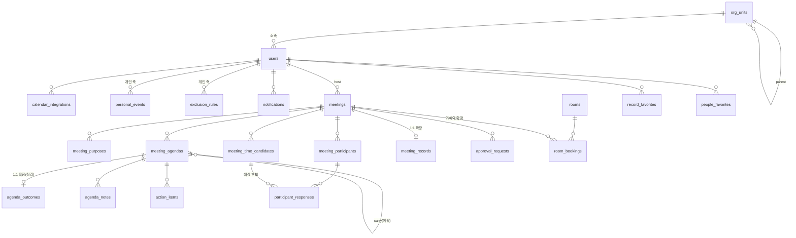

# ON AIR — 데이터베이스 스키마 v1.2

> 플랫폼 전 화면(캘린더 · 구성원 · 회의 기록 · 조율 · 알림)이 읽고 쓰는 데이터의 단일 정의.
> PostgreSQL 15+ 기준. 프로토타입(index.html)의 모든 전역 상태는 §9의 매핑 표로 이 스키마에 1:1 대응한다.

- 문서 버전: v1.2 · 작성일: 2026-07-12
- 상위 문서: [ARCHITECTURE.md](./ARCHITECTURE.md) · [CONTEXT-MODEL.md](./CONTEXT-MODEL.md) · [FLOW.md](./FLOW.md)
- 구현체: [index.html](./index.html)

---

## 0. 설계 원칙 — 스키마가 지키는 5가지 불변식

| # | 불변식 | 스키마 반영 |
|---|---|---|
| P1 | **회의 축은 투명, 개인 축은 비공개.** 목적·안건·참석·시간·성립 조건은 참석자 전원에게 보이고, 불가 사유·개인 일정 제목·제외 시간 이름은 본인 외 누구에게도 보이지 않는다. | 개인 축 테이블(`personal_events`, `exclusion_rules`)을 회의 축과 물리적으로 분리하고, 타인에게는 파생 뷰 `v_free_busy`의 구간·상태만 노출(RLS §8). 응답 테이블에 사유 컬럼 자체가 없다. |
| P2 | **한 사실은 한 곳에만 저장한다.** 회의의 참석자·안건은 조율 단계와 기록 단계가 같은 행을 본다 — 기록은 회의의 최종 상태이지 복사본이 아니다. | `meeting_records`는 `meetings`의 1:1 확장(PK=FK). 안건 결론은 `agenda_outcomes`가 `meeting_agendas`를 확장. 캘린더·기록·조율 큐는 전부 파생 뷰(§7). |
| P3 | **저장과 파생을 섞지 않는다.** free/busy, 후보 점수, 홈 통계, 조율 큐, 참석 등급은 저장하지 않고 항상 파생한다. | 파생값은 §7의 뷰/생성 컬럼으로만 정의. 예: `grade`는 `role`에서 GENERATED, `wrap 여부`는 `wrapped_by IS NOT NULL`. |
| P4 | **상태는 상태 기계로만 움직인다.** 회의는 `draft → consenting → (approving) → confirmed → closed`, 뒤로 가지 않는다. | `meetings.status` ENUM + 전이 트리거(§6). 홈 카드 4종은 이 상태의 파티션이라 한 회의가 두 버킷에 겹치지 않는다. |
| P5 | **사람 이름과 참석 관계는 `users` 한 곳에서 시작한다.** 구성원·초대·캘린더·기록은 문자열 이름을 복사하지 않고 모두 `user_id`를 참조한다. 주최자·응답자·정리자·액션 담당자는 반드시 해당 회의의 참석자다. | `meeting_participants(meeting_id,user_id)`를 참석 관계의 단일 원천으로 두고 복합 FK로 주최자·응답자·정리자·담당자를 제한한다. |

---

## 1. ERD



---

## 2. 도메인 타입 (ENUM)

```sql
CREATE TYPE rank_t              AS ENUM ('사원','주임','대리','과장','차장','팀장','본부장');
CREATE TYPE meeting_origin_t    AS ENUM ('decision','problem','share','routine','followup','other'); -- 목적 선택 6종
CREATE TYPE meeting_purpose_t   AS ENUM ('decide','ideate','inform','align','bond','other');
CREATE TYPE meeting_format_t    AS ENUM ('offline','online','hybrid');
CREATE TYPE meeting_status_t    AS ENUM ('draft','consenting','approving','confirmed','closed','expired');
CREATE TYPE participant_role_t  AS ENUM ('decide','info','exec','fyi');       -- 왜 이 사람인가
CREATE TYPE participant_grade_t AS ENUM ('req','opt','fyi');                  -- 필참·선택·공유만 (role에서 파생)
CREATE TYPE attendance_mode_t   AS ENUM ('onsite','remote','record');         -- 현장·원격·기록 수신
CREATE TYPE response_kind_t     AS ENUM ('consent','attendance');             -- 제안 응답 vs 확정 후 참석 응답
CREATE TYPE response_answer_t   AS ENUM ('yes','no');                         -- consent: 동의/불가 · attendance: 참석/불가
CREATE TYPE agenda_status_t     AS ENUM ('done','carry');                     -- 완료·이월
CREATE TYPE exclusion_level_t   AS ENUM ('block','deprioritize');             -- 막아둬요 / 우선순위만 낮춰요
CREATE TYPE exclusion_recur_t   AS ENUM ('once','weekly');                    -- 한 번만 / 매주 반복
CREATE TYPE event_source_t      AS ENUM ('manual','integration');             -- 개인 일정의 출처
CREATE TYPE integration_t       AS ENUM ('google','microsoft','apple','notion','slack','naverworks');
CREATE TYPE notification_kind_t AS ENUM ('meeting_confirmed','proposal_exhausted','approval_requested',
                                         'approval_decided','response_reminder','record_wrapped','integration_connected');
```

참석 3축의 파생 규칙(FLOW.md §7.7)은 스키마 수준에서 고정한다:

```
grade := role IN ('decide','info') → 'req' | role='exec' → 'opt' | role='fyi' → 'fyi'
attendance: format='online' → 전원 'remote' · format='offline' → 전원 'onsite'
            format='hybrid' → 사람별 onsite/remote 혼재(현장 ≥ 1) · grade='fyi' → 항상 'record'
```

---

## 3. 조직 · 사용자

```sql
CREATE TABLE org_units (                          -- 본부 > 팀 (자기참조 트리, 깊이 2)
  id          bigint GENERATED ALWAYS AS IDENTITY PRIMARY KEY,
  parent_id   bigint REFERENCES org_units(id),
  name        text NOT NULL,
  sort_order  int  NOT NULL DEFAULT 0,
  UNIQUE (parent_id, name)
);

CREATE TABLE users (
  id            bigint GENERATED ALWAYS AS IDENTITY PRIMARY KEY,
  org_unit_id   bigint NOT NULL REFERENCES org_units(id),   -- 팀
  name          text   NOT NULL,                            -- 조직에서 확정한 표시명. 전 화면은 이 값만 조회
  rank          rank_t NOT NULL,
  duty          text   NOT NULL,                            -- 직무 (예: 'PO · 로드맵')
  email         citext NOT NULL UNIQUE,
  work_start    smallint NOT NULL DEFAULT 540,              -- 출근, 자정 기준 분(09:00=540)
  work_lunch    smallint NOT NULL DEFAULT 750,
  work_end      smallint NOT NULL DEFAULT 1080,
  is_active     boolean NOT NULL DEFAULT true,
  created_at    timestamptz NOT NULL DEFAULT now(),
  CHECK (work_start < work_lunch AND work_lunch < work_end) -- 근무시간 순서 (UI 검증과 동일)
);
CREATE INDEX idx_users_org  ON users (org_unit_id) WHERE is_active;
CREATE INDEX idx_users_name ON users USING gin (name gin_trgm_ops);  -- 구성원 검색조건 '성명'

CREATE TABLE people_favorites (                   -- 구성원 즐겨찾기 (★ 컬럼)
  user_id   bigint NOT NULL REFERENCES users(id) ON DELETE CASCADE,
  target_id bigint NOT NULL REFERENCES users(id) ON DELETE CASCADE,
  PRIMARY KEY (user_id, target_id)
);
```

- 근무시간은 **사용자별 컬럼**이다 — 사람마다 출근·점심·퇴근이 다르며(2026-07-12 확정), 후보 순위 파생(§7)에서 "근무시간 밖 = 후순위"의 기준이 된다.
- 팀장 판별은 `rank >= '팀장'`으로 파생한다(상신 대상 추천). 상신 여부 자체는 회의별 지정(§5 `is_approver`).

---

## 4. 개인 축 — 가용성 (본인 외 열람 불가)

```sql
CREATE TABLE calendar_integrations (
  id           bigint GENERATED ALWAYS AS IDENTITY PRIMARY KEY,
  user_id      bigint NOT NULL REFERENCES users(id) ON DELETE CASCADE,
  provider     integration_t NOT NULL,
  scope        text NOT NULL DEFAULT 'free_busy',           -- 항상 free/busy 전용 (INTEGRATIONS.md)
  connected_at timestamptz NOT NULL DEFAULT now(),
  UNIQUE (user_id, provider)
);

CREATE TABLE personal_events (                    -- 일정 추가 + 연동 일정. 제목은 본인만 본다
  id             bigint GENERATED ALWAYS AS IDENTITY PRIMARY KEY,
  user_id        bigint NOT NULL REFERENCES users(id) ON DELETE CASCADE,
  title_private  text   NOT NULL,                            -- P1: 타인에게는 절대 노출 금지
  starts_at      timestamptz NOT NULL,
  ends_at        timestamptz NOT NULL,
  source         event_source_t NOT NULL DEFAULT 'manual',
  integration_id bigint REFERENCES calendar_integrations(id),
  is_hard        boolean NOT NULL DEFAULT false,             -- true=막아둬요(후보 제외) · false=우선순위만 낮춤
  CHECK (starts_at < ends_at),
  CHECK (source = 'manual' OR integration_id IS NOT NULL)
);
CREATE INDEX idx_pevents_user_time ON personal_events (user_id, starts_at);

CREATE TABLE exclusion_rules (                    -- 회의 제외 시간. 이름은 본인만 본다
  id         bigint GENERATED ALWAYS AS IDENTITY PRIMARY KEY,
  user_id    bigint NOT NULL REFERENCES users(id) ON DELETE CASCADE,
  name_private text NOT NULL,
  level      exclusion_level_t NOT NULL DEFAULT 'block',     -- 막아둬요 / 우선순위만 낮춰요 (2단계, 강도 수치 없음)
  recurrence exclusion_recur_t NOT NULL,
  on_date    date,                                           -- once 전용
  weekdays   smallint[] CHECK (weekdays <@ ARRAY[0,1,2,3,4,5,6]::smallint[]),  -- weekly 전용(0=월)
  start_min  smallint NOT NULL CHECK (start_min BETWEEN 0 AND 1439),
  end_min    smallint NOT NULL CHECK (end_min   BETWEEN 1 AND 1440),
  created_at timestamptz NOT NULL DEFAULT now(),
  CHECK (start_min < end_min),
  CHECK ((recurrence = 'once'   AND on_date IS NOT NULL AND weekdays IS NULL) OR
         (recurrence = 'weekly' AND on_date IS NULL AND cardinality(weekdays) > 0))
);
CREATE INDEX idx_excl_user ON exclusion_rules (user_id);
```

- `deprioritize`의 감점 가중치는 **엔진 상수**(파생 계층)다. 사용자에게 강도 숫자를 저장·노출하지 않는다(폐기된 '오늘 상태/강도' 모델을 스키마에 남기지 않음).
- 한 번만 제외는 개인 일정과 같은 축이므로 프로토타입에서는 `personal_events`로 저장한다 — 스키마상 두 표현 모두 `v_free_busy`로 수렴하므로 등가.

---

## 5. 회의 축 — 조율 (참석자 전원에게 투명)

```sql
CREATE TABLE meetings (
  id             bigint GENERATED ALWAYS AS IDENTITY PRIMARY KEY,
  host_id        bigint NOT NULL REFERENCES users(id),
  title          text   NOT NULL,
  origin         meeting_origin_t NOT NULL,                  -- 목적 선택(왜 여는가) — UI 표기는 '목적'
  format         meeting_format_t NOT NULL,
  duration_min   smallint NOT NULL CHECK (duration_min BETWEEN 30 AND 480 AND duration_min % 30 = 0),
  status         meeting_status_t NOT NULL DEFAULT 'draft',
  scribe_id      bigint REFERENCES users(id),                -- 설정 단계 기록 담당 (조회 UI 비노출)
  search_from    date NOT NULL,                              -- 후보 탐색 범위(기본 2주 · 최대 4주)
  search_to      date NOT NULL CHECK (search_to <= search_from + 28),
  confirmed_start timestamptz,                               -- status IN ('confirmed','closed')일 때만
  confirmed_end   timestamptz,
  room_id        bigint REFERENCES rooms(id),                -- offline/hybrid 확정 시
  online_url     text,
  followup_of    bigint REFERENCES meetings(id),             -- '이전 회의 후속' 연결 (기록 → 새 회의 연속성)
  created_at     timestamptz NOT NULL DEFAULT now(),
  CHECK ((status NOT IN ('confirmed','closed')) OR confirmed_start IS NOT NULL)
);
CREATE INDEX idx_meetings_status ON meetings (status, host_id);
CREATE INDEX idx_meetings_confirmed ON meetings (confirmed_start) WHERE status IN ('confirmed','closed');

CREATE TABLE meeting_purposes (                   -- 목적 다중 선택 (실제 회의는 유형이 섞인다)
  meeting_id bigint NOT NULL REFERENCES meetings(id) ON DELETE CASCADE,
  purpose    meeting_purpose_t NOT NULL,
  is_primary boolean NOT NULL DEFAULT false,
  PRIMARY KEY (meeting_id, purpose)
);

CREATE TABLE meeting_agendas (
  id             bigint GENERATED ALWAYS AS IDENTITY PRIMARY KEY,
  meeting_id     bigint NOT NULL REFERENCES meetings(id) ON DELETE CASCADE,
  position       smallint NOT NULL,
  title          text NOT NULL,
  purpose        meeting_purpose_t,                          -- 안건별 유형(자유 입력 → 키워드 파생)
  carried_from   bigint REFERENCES meeting_agendas(id),      -- 이월 안건의 출처 (후속 회의 체인)
  UNIQUE (meeting_id, position)
);

CREATE TABLE meeting_participants (
  meeting_id  bigint NOT NULL REFERENCES meetings(id) ON DELETE CASCADE,
  user_id     bigint NOT NULL REFERENCES users(id),
  role        participant_role_t NOT NULL,                   -- 저장은 역할 하나만
  grade       participant_grade_t GENERATED ALWAYS AS       -- 등급은 언제나 역할의 파생 (P3)
              (CASE WHEN role IN ('decide','info') THEN 'req'::participant_grade_t
                    WHEN role = 'exec'             THEN 'opt'::participant_grade_t
                    ELSE 'fyi'::participant_grade_t END) STORED,
  attendance  attendance_mode_t NOT NULL,
  is_approver boolean NOT NULL DEFAULT false,                -- 상신 대상(회의별 지정)
  PRIMARY KEY (meeting_id, user_id),
  CHECK (role <> 'fyi' OR attendance = 'record')             -- 공유만 = 기록 수신
);
CREATE INDEX idx_participants_user ON meeting_participants (user_id);

-- 주최자도 실제 참석자 한 행으로 반드시 저장한다. host_id는 소유·발송 권한을 가리키고,
-- meeting_participants는 캘린더·초대·기록에서 쓰는 참석 명단의 단일 원천이다.
-- 순환 참조이므로 회의와 참석자를 한 트랜잭션에서 넣고 COMMIT 때 검사한다.
ALTER TABLE meetings ADD CONSTRAINT fk_meeting_host_participant
  FOREIGN KEY (id, host_id)
  REFERENCES meeting_participants (meeting_id, user_id)
  DEFERRABLE INITIALLY DEFERRED;

ALTER TABLE meetings ADD CONSTRAINT fk_meeting_scribe_participant
  FOREIGN KEY (id, scribe_id)
  REFERENCES meeting_participants (meeting_id, user_id)
  DEFERRABLE INITIALLY DEFERRED;

CREATE TABLE meeting_time_candidates (            -- 추천안/대안 — 엔진 산출의 스냅샷(발송 시점 고정)
  id         bigint GENERATED ALWAYS AS IDENTITY PRIMARY KEY,
  meeting_id bigint NOT NULL REFERENCES meetings(id) ON DELETE CASCADE,
  rank       smallint NOT NULL,                              -- 1=추천안, 2·3=대안
  starts_at  timestamptz NOT NULL,
  ends_at    timestamptz NOT NULL,
  room_id    bigint REFERENCES rooms(id),
  is_active  boolean NOT NULL DEFAULT true,                  -- 재제안 시 이전 후보 비활성화(이력 보존)
  UNIQUE (meeting_id, rank, is_active) DEFERRABLE
);

CREATE TABLE participant_responses (              -- 사유 컬럼 없음 — 불가에 이유를 묻지 않는다 (P1)
  id           bigint GENERATED ALWAYS AS IDENTITY PRIMARY KEY,
  meeting_id   bigint NOT NULL REFERENCES meetings(id) ON DELETE CASCADE,
  user_id      bigint NOT NULL REFERENCES users(id),
  candidate_id bigint REFERENCES meeting_time_candidates(id),
  kind         response_kind_t NOT NULL,                     -- consent(동의/불가) · attendance(참석/불가)
  answer       response_answer_t NOT NULL,
  responded_at timestamptz NOT NULL DEFAULT now(),
  UNIQUE (meeting_id, user_id, kind, candidate_id),
  FOREIGN KEY (meeting_id, user_id)
    REFERENCES meeting_participants (meeting_id, user_id)
);

CREATE TABLE approval_requests (                  -- 상신 — 일반 참석자 전원 OK 후 생성
  id          bigint GENERATED ALWAYS AS IDENTITY PRIMARY KEY,
  meeting_id  bigint NOT NULL REFERENCES meetings(id) ON DELETE CASCADE,
  approver_id bigint NOT NULL REFERENCES users(id),
  status      text NOT NULL DEFAULT 'pending' CHECK (status IN ('pending','approved','rejected')),
  requested_at timestamptz NOT NULL DEFAULT now(),
  decided_at   timestamptz,
  UNIQUE (meeting_id, approver_id),
  FOREIGN KEY (meeting_id, approver_id)
    REFERENCES meeting_participants (meeting_id, user_id)
);

CREATE TABLE rooms (
  id       bigint GENERATED ALWAYS AS IDENTITY PRIMARY KEY,
  site     text NOT NULL,                                    -- 판교/강남
  floor    text NOT NULL,
  name     text NOT NULL,
  capacity smallint NOT NULL CHECK (capacity > 0),           -- 정원 산정 = 현장 인원만
  UNIQUE (site, floor, name)
);

CREATE TABLE room_bookings (
  id         bigint GENERATED ALWAYS AS IDENTITY PRIMARY KEY,
  room_id    bigint NOT NULL REFERENCES rooms(id),
  meeting_id bigint REFERENCES meetings(id) ON DELETE CASCADE,  -- NULL = 외부 예약
  starts_at  timestamptz NOT NULL,
  ends_at    timestamptz NOT NULL,
  CHECK (starts_at < ends_at),
  EXCLUDE USING gist (room_id WITH =, tstzrange(starts_at, ends_at) WITH &&)  -- 이중 예약 불가를 DB가 보장
);
```

---

## 6. 기록 — 공유 정리본 (별도 회의록 없음)

기록은 새 테이블 묶음이 아니라 **회의의 최종 상태**다(P2). 조율 때 정한 참석자(`meeting_participants`)·안건(`meeting_agendas`)을 그대로 재사용하고, 끝난 뒤 생기는 사실만 확장 테이블에 얹는다.

```sql
CREATE TABLE meeting_records (                    -- meetings 1:1 확장. 행 존재 = '끝난 회의'
  meeting_id  bigint PRIMARY KEY REFERENCES meetings(id) ON DELETE CASCADE,
  held_start  timestamptz NOT NULL,               -- 실제 진행 시각(확정 시각과 다를 수 있음)
  held_end    timestamptz NOT NULL,
  location_text text NOT NULL,                    -- 표기 규칙: offline=위치 한 줄 · online='온라인'
  wrapped_by  bigint REFERENCES users(id),        -- 정리한 사람. NULL = '정리 전'
  wrapped_at  timestamptz,
  CHECK ((wrapped_by IS NULL) = (wrapped_at IS NULL)),
  FOREIGN KEY (meeting_id, wrapped_by)
    REFERENCES meeting_participants (meeting_id, user_id)
);
CREATE INDEX idx_records_held ON meeting_records (held_start DESC);   -- 기록 목록 기본 정렬

CREATE TABLE agenda_outcomes (                    -- 정리 시 안건마다 정확히 한 줄의 결론
  agenda_id bigint PRIMARY KEY REFERENCES meeting_agendas(id) ON DELETE CASCADE,
  decision  text NOT NULL,                        -- '결정 없음 — 재논의'도 유효한 결론
  status    agenda_status_t NOT NULL DEFAULT 'done'
);

CREATE TABLE agenda_notes (                       -- 발언·논의 흐름 (검색조건 '안건·발언·결론'의 원천)
  id        bigint GENERATED ALWAYS AS IDENTITY PRIMARY KEY,
  agenda_id bigint NOT NULL REFERENCES meeting_agendas(id) ON DELETE CASCADE,
  position  smallint NOT NULL,
  body      text NOT NULL
);

CREATE TABLE action_items (
  id        bigint GENERATED ALWAYS AS IDENTITY PRIMARY KEY,
  agenda_id bigint NOT NULL REFERENCES meeting_agendas(id) ON DELETE CASCADE,
  owner_id  bigint REFERENCES users(id),
  due_on    date,
  title     text NOT NULL,
  done_at   timestamptz
);

-- action_items.owner_id는 agenda_id가 속한 회의의 참석자여야 한다.
-- agenda_id → meeting_id를 따라가는 교차 테이블 규칙이라 단순 CHECK로는 보장할 수 없으며,
-- INSERT/UPDATE 시 meeting_agendas와 meeting_participants를 조인하는 constraint trigger로 검사한다.
CREATE FUNCTION assert_action_owner_is_participant() RETURNS trigger
LANGUAGE plpgsql AS $$
DECLARE v_meeting_id bigint;
BEGIN
  IF NEW.owner_id IS NULL THEN RETURN NEW; END IF;
  SELECT meeting_id INTO v_meeting_id FROM meeting_agendas WHERE id = NEW.agenda_id;
  IF NOT EXISTS (
    SELECT 1 FROM meeting_participants
     WHERE meeting_id = v_meeting_id AND user_id = NEW.owner_id
  ) THEN
    RAISE EXCEPTION 'action owner % is not a participant of meeting %', NEW.owner_id, v_meeting_id;
  END IF;
  RETURN NEW;
END $$;

CREATE CONSTRAINT TRIGGER trg_action_owner_is_participant
AFTER INSERT OR UPDATE OF agenda_id, owner_id ON action_items
DEFERRABLE INITIALLY DEFERRED
FOR EACH ROW EXECUTE FUNCTION assert_action_owner_is_participant();

CREATE TABLE record_favorites (
  user_id    bigint NOT NULL REFERENCES users(id) ON DELETE CASCADE,
  meeting_id bigint NOT NULL REFERENCES meeting_records(meeting_id) ON DELETE CASCADE,
  PRIMARY KEY (user_id, meeting_id)
);

CREATE TABLE notifications (                      -- 표준 형식: 과거 시제 통지 + 읽으면 뱃지 소멸
  id         bigint GENERATED ALWAYS AS IDENTITY PRIMARY KEY,
  user_id    bigint NOT NULL REFERENCES users(id) ON DELETE CASCADE,
  actor_user_id bigint REFERENCES users(id) ON DELETE SET NULL, -- 알림을 발생시킨 사람. 시스템 알림은 NULL
  kind       notification_kind_t NOT NULL,
  meeting_id bigint REFERENCES meetings(id) ON DELETE SET NULL,
  body       text NOT NULL,
  created_at timestamptz NOT NULL DEFAULT now(),
  read_at    timestamptz                           -- NULL = 미읽음(벨 뱃지). 행동 요청은 알림이 아니라 큐가 담당
);
CREATE INDEX idx_notif_unread ON notifications (user_id) WHERE read_at IS NULL;

CREATE TABLE notification_settings (              -- 설정 > 알림 토글. 끄면 그 종류는 생성 단계에서 걸러진다
  user_id  bigint PRIMARY KEY REFERENCES users(id) ON DELETE CASCADE,
  confirm  boolean NOT NULL DEFAULT true,         -- 회의 확정 (meeting_confirmed)
  progress boolean NOT NULL DEFAULT true,         -- 조율 진행 (발송·응답·승인·재제안)
  reminder boolean NOT NULL DEFAULT true,         -- 응답 리마인드 (response_reminder)
  wrap     boolean NOT NULL DEFAULT true          -- 회의 정리 (record_wrapped·종결 배포)
);
```

`notification_kind_t` → 설정 4분류 매핑: `meeting_confirmed→confirm`, `approval_*·proposal_exhausted→progress`, `response_reminder→reminder`, `record_wrapped→wrap`, `integration_connected`은 무분류(항상 통지).

리마인드는 수신자별 알림 행으로 남긴다. `user_id`는 수신자, `actor_user_id`는 발신자, `meeting_id`는 대상 회의다. 프로토타입의 수신 알림 미리보기는 이 세 FK를 `recipientId / senderId / entityId`로 투영한다.

```sql
INSERT INTO notifications (user_id, actor_user_id, kind, meeting_id, body)
VALUES (:recipient_id, :sender_id, 'response_reminder', :meeting_id, :body);
```

**정리(wrap) 트랜잭션** — 참석자 누구든 1회 수행, 전원이 같은 행을 본다:

```sql
BEGIN;
  UPDATE meeting_records SET wrapped_by = :me, wrapped_at = now() WHERE meeting_id = :m AND wrapped_by IS NULL;
  -- 0행이면 이미 다른 참석자가 정리한 것 → 그 정리본을 보여주고 종료 (동시성 안전)
  INSERT INTO agenda_outcomes (agenda_id, decision, status) VALUES ... ;  -- 안건 수만큼
  INSERT INTO notifications (user_id, kind, meeting_id, body)
    SELECT p.user_id, 'record_wrapped', :m, ... FROM meeting_participants p WHERE p.meeting_id = :m;
COMMIT;
```

**상태 기계** (전이는 트리거로 강제, 역행 금지):

```
draft ──발송──▶ consenting ──필참 전원 yes──▶ confirmed ──진행 완료──▶ closed(=meeting_records 생성)
                   │  └─상신 대상 있음─▶ approving ─승인─▶ confirmed
                   └─후보 소진─▶ expired(재구성 유도)
closed 이후: wrapped_by NULL(정리 전) → NOT NULL(정리됨)   ← 상태가 아니라 기록의 속성
```

---

## 7. 파생 계층 — 저장하지 않는 것들의 공식 정의

| 파생값 | 정의 (원천 테이블) | 소비처 |
|---|---|---|
| `v_free_busy(user, range)` | `personal_events(is_hard)` ∪ 확정 회의(`meetings.confirmed_*` × 참석) ∪ `exclusion_rules(level='block')` → `busy_hard`; `personal_events(!is_hard)` ∪ `exclusion_rules('deprioritize')` → `busy_soft` | 후보 엔진 · 캘린더 워시. **타인에게 공개되는 유일한 개인 축 파생물** — 구간과 hard/soft만, 제목·이름 없음 |
| 후보 순위 | 필참 전원 `busy_hard` 없음(하드) 필터 후, `busy_soft` 감점 + 근무시간 밖(`users.work_*`) 감점 + 주말 감점. 가점 없음 — 기준은 시간을 밀어낼 수만 있다 | `meeting_time_candidates` 생성(발송 시점 스냅샷) |
| 내 캘린더 | 확정 회의(참석 행 존재) ∪ `personal_events` ∪ 미응답 초대(`consenting` × 내가 필참·선택 × 응답 없음) ∪ **끝난 회의(`meeting_records` × 내 참석)** — 2026-07-12: 기록도 캘린더의 과거로 투영, 원천은 여전히 한 곳 | 주·일·월 뷰 |
| 홈 4카드 | ①이번 주 회의 = 내 캘린더 중 이번 주 × 회의만 ②응답할 초대 = 미응답 `consenting` ③생성한 회의 = 내가 host인 `consenting/approving` ④정리할 회의 = `meeting_records.wrapped_by IS NULL` × 내 참석 — status 파티션이라 상호 배타 | 캘린더 홈 |
| 기록 목록 행 | `meeting_records` JOIN `meetings` — 결론 컬럼 = 첫 안건의 `agenda_outcomes.decision`(정리 전은 공백), 정리 컬럼 = `wrapped_by` 이름 또는 '정리 전' | 회의 기록 테이블 |
| 기록 검색 필드 | when=`held_*` · title=`title+purpose+location_text` · content=`agendas.title+notes.body+outcomes.decision+action_items` · people=참석자명+등급·형태 라벨+`wrapped_by` | 검색조건 셀렉트 4종 |
| 최근 함께한 사람 | `meeting_participants` 빈도 상위 (기록 포함) | 위저드 자동완성 |

전문 검색은 `meeting_records`에 대한 materialized tsvector(`record_search_mv`: 한국어 형태소 + trgm)로 구현하고, 기록은 append-mostly이므로 wrap 트랜잭션 후 REFRESH한다.

---

## 8. 프라이버시 매트릭스 (RLS 요약)

| 테이블 | 본인 | 같은 회의 참석자 | 조직 전체 |
|---|---|---|---|
| `personal_events` | 전체 | ✕ (`v_free_busy` 구간만) | ✕ |
| `exclusion_rules` | 전체 | ✕ (구간만) | ✕ |
| `participant_responses` | 전체 | answer만 (사유 컬럼 자체가 없음) | ✕ |
| `meetings`·`meeting_agendas`·`meeting_participants` | — | 전체 (회의 축 투명) | ✕ |
| `meeting_records`+정리 테이블 | — | 전체 | 전체 (기록 저장소는 조직 아카이브) |
| `users` (근무시간 포함) | 전체 | — | 업무 축 컬럼만 (출퇴근 시간은 공개 — 구성원 테이블 컬럼) |
| `notifications` | 전체 | ✕ | ✕ |

---

## 9. 프로토타입 매핑 — index.html 전역 ↔ 스키마

| JS 전역 | 테이블/뷰 | 비고 |
|---|---|---|
| `CONTACTS`(현재 사용자 `ME` 포함) · `ORG_PLAN` | `users` · `org_units` | 현재 사용자도 별도 복사본이 아니라 같은 명부 행을 쓴다. genOrg 시드 = 조직 시드 데이터 |
| `WORK` | `users.work_start/lunch/end` | 프로토타입은 나 1인분만 보유 |
| `MY_EVENTS` (manual) | `personal_events` | `hard` ↔ `is_hard` |
| `MY_EVENTS` (google 등) · `MONTH_EVENTS` | `personal_events(source='integration')` + 확정 회의 파생 | |
| `MY_PREFS` | `exclusion_rules(recurrence='weekly')` | `pol:block/avoid` ↔ `level` |
| 한 번만 제외(제외 모달 once 저장) | `exclusion_rules(recurrence='once')` (프로토타입은 `personal_events`로 등가 표현) | §4 |
| `MEETINGS` + `makeMeeting` | `meetings`+`meeting_purposes`+`meeting_agendas`+`meeting_participants`+`meeting_time_candidates` | `hostId`도 `mAllParticipants()`의 한 행. `status: consent→consenting` |
| `INVITES` + `st.inviteResp` | 내가 참석자인 `consenting` 회의 + `participant_responses(kind='consent')` | `hostId`는 users FK, `inviteParticipants()`가 현재 수신자까지 포함한 전체 명단과 파생 등급을 만든다. |
| `RECORDS` | `meeting_records`+`agenda_outcomes`+`agenda_notes`+`action_items` | `hostId`와 `who`가 같은 회의 참석자를 참조. `wrap:{by,at}` ↔ `wrapped_by/at` · `who:{role,att}` ↔ `meeting_participants` |
| `DEMO_DATA_AUDIT` | 시드/fixture FK·CHECK 검증 | users 134명, 초대·일정·기록·수명주기 회의를 부팅 시 전수 검사. 오류면 `html[data-demo-integrity='error']`와 콘솔에 경로를 남긴다. |
| `recordEvents()` | 내 캘린더 파생(§7 '내 캘린더'의 기록 항) | 이번 엔진 주 이전만 투영(중복 방지) |
| `recordFavorite` / `st.pplFavs` | `record_favorites` / `people_favorites` | |
| `ROOMS_DATA`+`bk` | `rooms`+`room_bookings` | EXCLUDE 제약이 `roomFree()` 대체 |
| `NOTIFS`+`notifUnread` | `notifications`(+`read_at IS NULL` 뱃지) | 열람 시 일괄 `read_at=now()` |
| `MEETINGS.reminded[userId]` | `notifications(kind='response_reminder')` | 버튼의 `리마인드됨`은 해당 회의·수신자의 최신 발송 행 존재 여부로 파생 |
| `MY_BUSY`/`MY_SOFT`/`rebuildBusy` | `v_free_busy` | 저장 아님 — 프로젝션 |
| `coordData()`/`homeStats()` | §7 홈 4카드 쿼리 | |
| `EVENT_INFO`/`EVENT_CAT` | (폐기 대상) — 회의 메타는 `meetings`에서, 분류색은 스키마에 없음 | |

---

## 10. 인덱스·운영 메모

- 조율 화면의 지배적 쿼리는 "내가 걸린 진행 중 회의" — `idx_participants_user` + `idx_meetings_status`의 조인이 커버한다.
- 기록 목록은 `idx_records_held DESC` 커서 페이지네이션(20행). 필터(기간·방식·목적)는 `meetings(format)`·`meeting_purposes` 보조 인덱스로.
- `room_bookings`의 EXCLUDE 제약은 btree_gist 확장 필요. 애플리케이션 검사(`roomFree`)는 UX용이고 정합성의 최종 방어선은 DB다.
- 후보 스냅샷(`meeting_time_candidates`)은 재제안 시 `is_active=false`로 남긴다 — "몇 번째 제안에서 성립했나"가 회의 문화 지표(집계 분석의 원천)가 된다.
- 시간은 전부 `timestamptz`(UTC 저장), 분 단위 필드만 `smallint`(자정 기준 분). 프로토타입의 엔진 날짜 인덱스(d 0–27)는 `BASE_MON + d일`로 환산되는 뷰 개념일 뿐 스키마에는 존재하지 않는다.

---

## 11. 더미 데이터 참조 무결성 검수 (2026-07-12)

| 범위 | 건수 | 확인한 계약 | 결과 |
|---|---:|---|---|
| 구성원 `CONTACTS` | 134명 | 현재 사용자 `권민주` 포함, 사용자 ID·이메일 유일, 조직·직급·직무 존재, 표시·엔진·DB 근무시간 `09:00–18:00` 일치 | 통과 |
| 받은 초대 `INVITES` | 3건 | `hostId`와 모든 참석자가 users에 존재, 현재 수신자 포함, 역할→등급 파생, 필참 동의 수 범위, 형식→현장/원격 일치 | 통과 |
| 캘린더 회의 `EVENT_INFO` | 24종 | 참석자 ID가 users에 존재, 목적·안건 존재, ON AIR 이벤트마다 상세 투영 존재 | 통과 |
| 회의 기록 `RECORDS` | 52건 | 주최자·기록자·정리자·액션 담당자가 동일 회의 참석자, 역할·참석 형태 일치, 참석자 중복 없음 | 통과 |
| 수명주기 `MEETINGS` | 2건 | 주최자 포함 전체 참석자, 역할 참조, 목적 참조, 주최자 중복 선택 방지 | 통과 |

검사는 `auditDemoData()`가 페이지 부팅 시 전수 실행한다. 오류가 없으면 `html[data-demo-integrity="ok"]`, 오류가 있으면 `error`와 함께 `data-demo-integrity-errors` 및 콘솔에 정확한 데이터 경로를 남긴다. 정적 더미 데이터가 추가되거나 컬럼이 바뀌면 이 검사를 함께 수정해야 한다.
